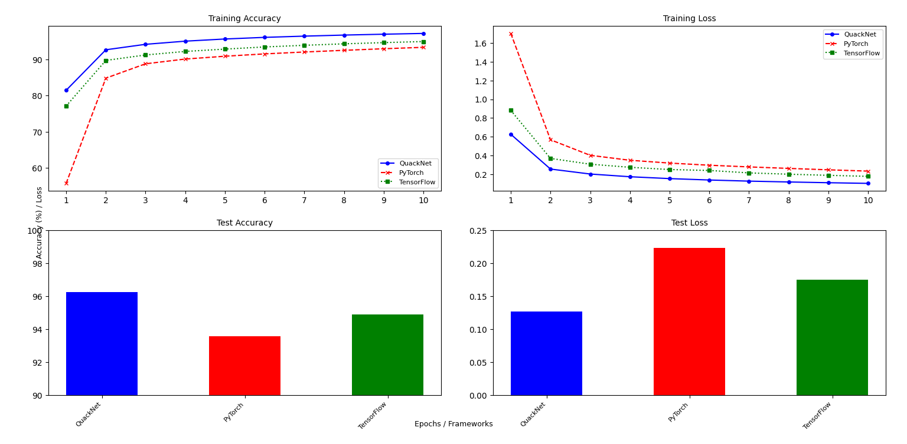

# QuackNet

> Built from scratch by a 16-year-old, QuackNet implements NN, CNN, RNN, and Transformers entirely in NumPy, with 150+ unit tests, PyPI distribution, and benchmarks that outperform PyTorch/TensorFlow on MNIST.


**QuackNet** is a from scratch deep learning library in NumPy with full support for Neural Networks, CNNs, RNNs, and Transformers. Educational and benchmarked against PyTorch and TensorFlow.

[](https://pypi.org/project/QuackNet/) 
[](https://ethanr168.github.io/QuackNet/quacknet.html)
[](LICENSE)

---

## Why QuackNet?

Most high level ML libraries (TensorFlow and PyTorch) abstract away the inner workings of deep learning models.

**QuackNet** exposes every step of the process:
-   Forward and backward propagation
-   Manual gradient computation
-   Weight and bias updates layer by layer

Built to be both an educational tool and a lightweight research framework, QuackNet allows you to experiment with novel architectures while understanding every underlying computation.

---

## Key Features

-   **No ML frameworks used:** built only with NumPy
-   **Core Models:**
    -   Neural Network (Dense)
    -   Convolutional Neural Network (Conv1D/2D, Pooling, Flatten, Global Average Pooling)
    -   Recurrent Neural Network (Singular and Stacked RNN)
    -   Transformer (Encoder & Decoder, multi head attention, normalisation, residual connections, positional encoding)
-   **Activation Functions:** ReLU, Leaky ReLU, Sigmoid, SoftMax, Tanh
-   **Loss Functions:** Cross Entropy, MSE, MAE
-   **Optimisers:** GD, SGD, Adam, AdamW, RMSProp, Lion
-   **Utilities:**
    -   Save/load weights and biases
    -   Visualise training progress (accuracy/loss graphs)
    -   Evaluate metrics (accuracy, loss)
    -   Real world demo projects (MNIST, HAM10000 skin lesions)
    -   Data augmentation (flipping)
-   **Professional Engineering:**
    -   PyPi installable
    -   Automated documentation via ```pdoc```
    -   150+ unit tests with 91% coverage
    -   Modular, beginner friendly API

---

## Installation

Install QuackNet from PyPI:

```bash
pip install QuackNet
```
 
---

## Quick Start

```python

from quacknet import Network

n = Network(lossFunc="Cross Entropy", learningRate=0.01, optimisationFunc="SGD")
n.addLayer(3)           
n.addLayer(1, "SoftMax")
n.createWeightsAndBiases()

inputData = [[0.1, 0.2, 0.3], [0.4, 0.5, 0.6]]
labels = [[1], [0]]

accuracy, averageLoss = n.train(inputData, labels, epochs=5)
```

For more detailed examples, see [Advanced Usage](#advanced-usage) or [Examples](#examples)

---

## Examples

-   [Simple Neural Network Example](/ExampleCode/NNExample.py): A basic neural network implementation demonstrating forward and backpropagation
-   [Convolutional Neural Network Example](/ExampleCode/CNNExample.py): Shows how to use the convolutional layers in the library
-   [MNIST Neural Network Example](/ExampleCode/MNISTExample/mnistExample.py): Trains a neural network on the MNIST dataset using QuackNet
-   [Singular Recurrent Neural Network Example](/ExampleCode/RNNSingularExample.py): Shows how to use the Singular RNN 
-   [Stacked Recurrent Neural Network Example](/ExampleCode/RNNStackedExample.py): Shows how to use the Stacked RNN 
-   [Transformer Example](/ExampleCode/TransformerExample.py): Shows how to use the Transformer
---

## Advanced Usage
Here is an example of how to create and train a simple neural network using the library:
```python
from quacknet import Network

# Define a neural network architecture
n = Network(
    lossFunc = "Cross Entropy",
    learningRate = 0.01,
    optimisationFunc = "SGD", # Stochastic Gradient Descent
)
n.addLayer(3)            # Input layer
n.addLayer(2, "ReLU")    # Hidden layer
n.addLayer(1, "SoftMax") # Output layer
n.createWeightsAndBiases()

# Train the network
accuracy, averageLoss = n.train(mnist_images, mnist_labels, epochs = 10)

# Evaluate
print(f"Accuracy: {accuracy}%")
print(f"Average loss: {averageLoss}")
```

**Note:** This example assumes input and labels are preprocessed as NumPy arrays. You can use [this script](ExampleCode/MNISTExample/saveMNISTimages.py) to download and save MNIST images using `torchvision`.

---

## Benchmark

### QuackNet vs PyTorch & TensorFlow

QuackNet was benchmarked against PyTorch and TensorFlow using the MNIST dataset,using identical architectures and hyperparameters to ensure fair comparison. Also each framework ran 5 times, and was averaged at the end.

Parameters:
-   **Neural Network Model Architecture:** 784 (input) → 128 → 64 → 10 (output)
-   **Activation Function:** Leaky ReLU for input and hidden layers, and SoftMax for output layer
-   **Optimiser:** Gradient Descent with Batches
-   **Batch Size:** 64
-   **Learning rate:** 0.01
-   **Epochs** 10

| Framework   | Accuracy | Loss  |
|-------------|----------|-------|
| QuackNet    | 96.26%   | 0.127 |     
| PyTorch     | 93.58%   | 0.223 |
| TensorFlow  | 94.88%   | 0.175 |



**Note:** Due to differences in weight initialisation, dataset shuffling, and random seeds, QuackNet may perform slightly better some runs. 

**Benchmark scripts:**

-   The code for the QuackNet benchmark can be found [here](benchmarkFolder/MNISTBenchmark/mnistExample.py)
-   The code for the PyTorch benchmark can be found [here](benchmarkFolder/MNISTBenchmark/pytorchBenchmark.py)
-   The code for the TensorFlow benchmark can be found [here](benchmarkFolder/MNISTBenchmark/tensorflowBenchmark.py)

### QuackNet benchmark on MNIST

The code for this benchmark can be found is the same as the one used to benchmark against PyTorch and TensorFlow.

Below is the graph showing the training accuracy and loss over 10 epochs, across 5 runs:


---

## Learning Outcomes

**ML Foundations**
-   Manual backpropagation (dense, convolutional, RNN BPTT, attention)
-   Gradient derivation and chain rule
-   Optimisers: SGD, GD, Adam, AdamW, RMSProp, Lion

**Computer Science Practice**
-   150+ unit tests, 91% coverage
-   Modular, beginner friendly API design
-   Efficient vectorised operations via NumPy
-   Automated documentation with ```pdoc```

---

## Roadmap

- [X] **Forward propagation**
    Implemented the feed forward pass for neural network layers
- [X] **Activation functions**
    Added support for Leaky ReLU, Sigmoid, SoftMax, and others
- [X] **Loss functions**
    Implemented MSE, MAE, and Cross Entropy loss with their derivatives
- [X] **Backpropagation**
    Completed backpropagation for gradient calculation and parameter updates
- [X] **Optimisers**
    Added support for batching, stochastic gradient descent and gradient descent
- [X] **Convolutional Neural Network**
    Implemented kernels, pooling and dense layers for Convolutional Neural Network
- [X] **Visualisation tools**  
    Added support for visualising training, such as loss and accuracy graphs
- [X] **Benchmark against PyTorch/TensorFlow**
    Benchmark against popular machine learning frameworks on MNIST dataset
- [X] **Add Adam optimiser**  
    Implement the Adam optimiser to improve training performance and convergence
- [X] **Data augmentation**
    Add data augmentation such as flipping, rotation and cropping
- [X] **Input Data augmentation:**
    Add pixel normalisation of pixels and one-hot encoded label
- [X] **Skin Lesion detector**    
    Use the neural network library to create a model for detecting skin lesions using HAM10000 for skin lesion images
- [X] **Recurrent Neural Network**
    Implement BPTT, with singular and stacked RNN implementation
- [X] **Transformer**
    Implement Multi head Attention, residual connections, normalisation, positional encoding

## Future Roadmap

QuackNet is now fully functional, stable and suitable for educational and experimental use. Future improvements are optional extensions to enchance capabilities and explore advanced research directions:

- [ ] **Additional activation functions**  
    Implement advanced activation functions (eg. GELU and Swish)
- [ ] **Additional regularisation**
    Add L1/L2 regularisation and dropout to improve model generalisation and reduce overfitting
- [ ] **Expanded demo projects**
    Include additional example projects on more complex datasets to demonstrate practical applications of QuackNet
- [ ] **Experimental optimisers**
    Implement novel optimisation algorithms for experimentation and research purposes

---

## Unit Tests

QuackNet includes unit tests that ensures the reliability of QuackNet's neural and convolutional components. They help to confirm that all layers and training processes behave as expected after every major update to ensure structural stability of all components. The tests are organised into directories:
-   [Unit Tests for NN](/unitTests/NN/) - for standard neural network tests 
-   [Unit Tests for CNN](/unitTests/CNN/) - for convolutional network specific tests 
-   [Unit Tests for RNN](/unitTests/RNN/) - for recurrent network specific tests 
-   [Unit Tests for Transformers](/unitTests/Transformer/) - for transformer specific tests 
-   [Unit Tests for Core code](/unitTests/core/) - for core code specific tests

These tests cover:

-   Forward and backward propagation for both NN, CNN, RNN, and transformers
-   Specific layers: Dense, Convolutional, Pooling, Multi head attention, Norm
-   Activation/loss functions, including their derivatives
-   Optimisation (SGD, GD, Adam, AdamW, RMSProp, Lion)

To run the tests:

```bash
pytest
```

To check test coverage:

```bash
coverage run -m pytest
coverage report -m
```

---

## Related Projects

### Skin Lesion Detector

A convolutional neural network (CNN) skin lesion classification model built with QuackNet, trained using the HAM10000 dataset. This model achieved 72% accuracy on a balanced validation set of skin lesion images.

You can explore the full project here:
[Skin Lesion Detector Repository](https://github.com/SirQuackPng/skinLesionDetector)

This project demonstrates how QuackNet can be applied to real-world image classification tasks.

---

## Project Architecture

### Neural Network Class
-   **Purpose** Handles fully connected layers for standard neural network
-   **Key Components:**
    -   Layers: Dense Layer
    -   Functions: Forward propagation, backpropagation
    -   Optimisers: SGD, GD, GD, Adam, AdamW, RMSProp, Lion

### Convolutional Neural Network Class
-   **Purpose** Specialised for image data processing using convolutional layers
-   **Key Components:**
    -   Layers: Convolutional, pooling, dense and activation layers
    -   Functions: Forward propagation, backpropagation, flattening, global average pooling
    -   Optimisers: SGD, GD, GD, Adam, AdamW, RMSProp, Lion

### RNN Class
-   **Purpose** Handles sequential data with temporal dependencies
-   **Key Components:**
    -   Layers: Singular RNN, Stacked RNN
    -   Functions: Forward propagation across time steps, backpropagation through time (BPTT)
    -   Optimisers: SGD, GD, GD, Adam, AdamW, RMSProp, Lion

### Transformer Class
-   **Purpose** Handles sequences with long range dependencies using attention mechanisms
-   **Key Components:**
    -   Layers: Multi head self attention, position wise feed forward network, embeddings, positional encoding
    -   Functions: Forward propagation, residual connections, layer normalisation, backpropagation
    -   Optimisers: SGD, GD, GD, Adam, AdamW, RMSProp, Lion

---

## License

This project is licensed under the MIT License - see the [LICENSE](LICENSE) file for details.

---

